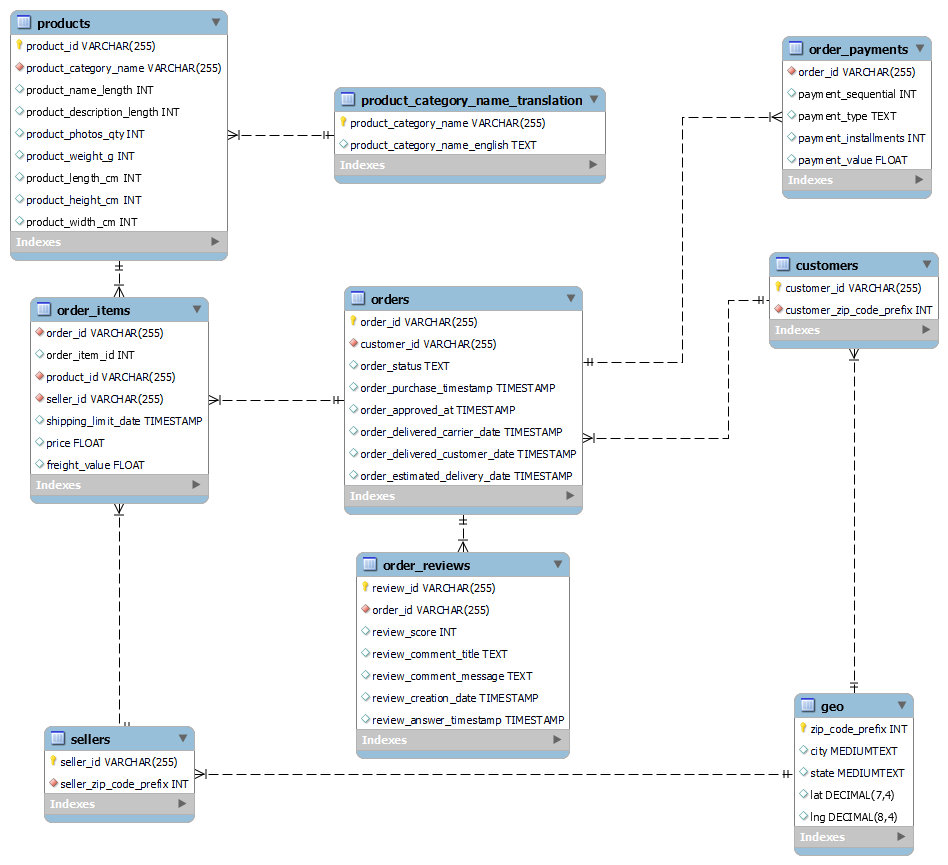

# Objective

The main purpose of this project is whether to recommend or not to Eniac, an online marketplace specializing in Apple-compatible accessories, as an intermediate step for an expansion to the Brazilian market to sign a deal with Magist, a Brazilian Software as a Service company that offers a centralized order management system to connect small and medium-sized stores with the biggest Brazilian marketplaces.

# Main concerns

Eniac’s catalog is 100% tech products, and heavily based on Apple-compatible accessories. It is not clear that the marketplaces Magist works with are a good place for these high-end tech products.

Among Eniac’s efforts to have happy customers, fast deliveries are key. The delivery fees resulting from Magist’s deal with the public Post Office might be cheap, but at what cost? Are deliveries fast enough?

Thankfully, Magist has allowed Eniac to access a snapshot of their database. The data might have the answer to these concerns.

**I answer these concerns by exploring the data using SQL and visualize it using Tableau.**

Here is the [link](https://public.tableau.com/views/MagistProjectBusinessAnalysis/ProductsDashboard?:language=en-US&publish=yes&:display_count=n&:origin=viz_share_link) to the vizzes created using Tableau Public.

# Some information about Eniac

Here are some numbers that will help you understand Eniac’s scope (data from April 2017 – March 2018):

* Revenue: 40,044,542 €
* Avg monthly revenue: 1,011,256 €
* Avg order price: 710 €
* Avg item price: 540 €

# Understand the schema

Here the schema of the database.

## Tables that are just collections of items, independent of any transaction

* products. contains a row for each product available for sale.
* product_category_name_translation. contains a relation of product categories in its original language, Portuguese, and English.
* sellers. contains a row for each one of the sellers registered in Magist’s marketplace.
* customers. contains a row for each customer that has made a purchase.
* geo. contains a relation between zip codes, coordinates, and states, to obtain more precise information about sellers and customers.

Unless a new customer makes a purchase, a new product is released, or a new seller is registered, these tables remain unchanged during a transaction.

## Tables responsible for capturing a purchase

* orders. every time that an order is placed, a row is inserted in this table. Even if the order contains multiple products, here it will be reflected as a single row with an order_id that uniquely identifies it.
* order_items. this table contains one row for each distinct product of an order.

## Tables storing information regarding payment and reviews

* order_payments. customers can pay an order with different methods of payment.  Every time a payment is made, a row is inserted here. An order can be paid in installments, which means that a single order can have many separate payments.
* order_reviews. customers can leave multiple reviews corresponding to the order they placed.

# Summary

* Eniac's avg price 540 > Magist's avg price of tech products 132.
* The avg monthly revenue of Eniac is 1,011,256 > 131,118 the avg monthly revenue of all Magist tech sellers.
* The average delivery time is 12 days in Magist market, while Apple standard delivery time is 1-3 days.

# Final recommendation
There is a lack of data to make a better educated decision. However, according to the available data Magist is not a good fit for high-end tech products. Therefore, I recommend that Eniac should not sign the deal with Magist.
